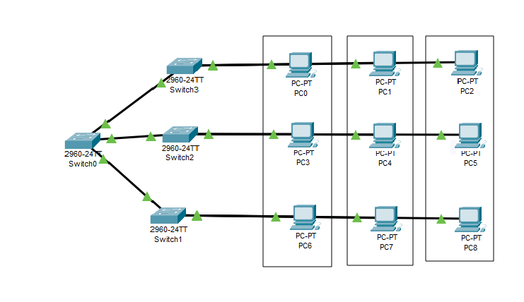

# Exercício 5
## Sobre o projeto:
Esse projeto tem como objetivo simular um ambiente onde VLAN foram configuradas para segmentar a rede. 
## Exercício utilizado para a criação do projeto:
+ Criação de 3 VLAN.
+ 4 Switchs 2960
+ 9 pcs (hosts) distribuídos em 3 andares de um prédio
+ VLAN10 - Secretaria
+ VLAN20 - Biblioteca
+ VLAN30 - Laboratório
+ **Switch1 - Access:**
+ PC0 - FastEthernet 0/1 –VLAN10
+ PC1 - FastEthernet 0/2 –VLAN20
+ PC2 - FastEthernet 0/3 –VLAN30
+ **Switch2 - Access:**
+ PC3 - FastEthernet 0/1 –VLAN10
+ PC4 - FastEthernet 0/2 –VLAN20
+ PC5 - FastEthernet 0/3 –VLAN30
+ **Switch3 - Access:**
+ PC6 - FastEthernet 0/1 –VLAN10
+ PC7 - FastEthernet 0/2 –VLAN20
+ PC8 - FastEthernet 0/3 –VLAN30
## Tecnologias utilizadas:
O projeto utiliza o Cisco Packet Tracer. 

## Principais funcionalidades:
Simular um ambiente onde três VLANs foram adicionadas. \
!

